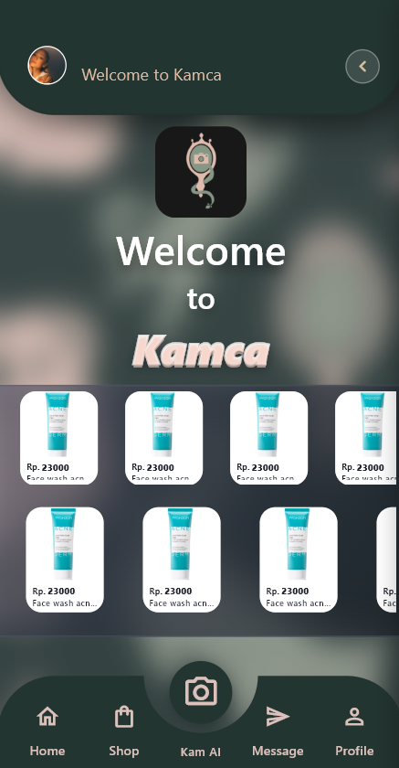
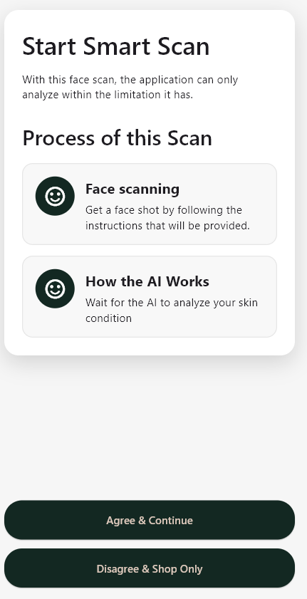
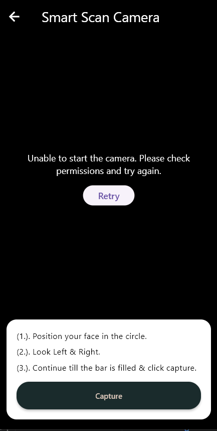
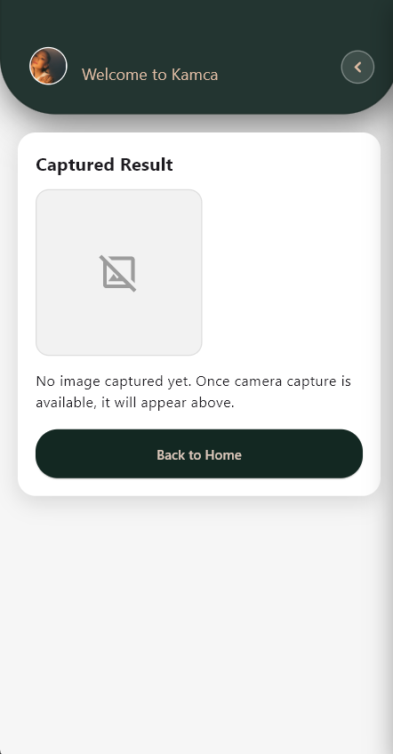
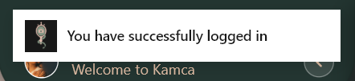

# Kamca

## Details:

This repository was created as a means to create the Kamca app, which was part of a Cakrawala University's asiggnment to me as a student, particularly in the program of Mobile Computing; lead by the lecturer Proffesor Aldrich Sancho Sapata Negara.

##### For better understanding this is also a link to the Figma design: 
https://www.figma.com/design/5yL2a3dWxneqcc83hESa7X/UAS_DgTg3_Group9?node-id=9-4&t=otDFtpvO1HDMW0I7-1

  
Log In.

  
  ### A screenshot of what that should look like:

  

  #### How to log in?
  One can use the username 'teddy' and the password 'teddy123' or for a secret account used for testing 'Galinda' with the password 'Elph4ba'; all rights belong to universal studio and all parties involved in Wicked towards the character Galinda and Elphaba, this project is meant to just be in the field of education and is not a comercial product; The Wicked cast and universal studios is not associated with or has any forms endorsements with Kamca, for Kamca is not an actual company nor app, to reitterate this is solely a project meant for educational purposes only. There is currently no way to create a new account.

  
Home Page.

  
  ### A screenshot of what that should look like:

  

  #### What can you do?
  When clickin the button in the far right of the header, one can find the log out button; there are animations present in the app; the only funtional button in the footer is the camera.

  
Pre Camera Page.

  
  ### A screenshot of what that should look like:

  

  #### What can you do?
  When clickin the agree button the camera will be deployed; when disagreeing then one will go back to the home page.

  
Camera Page.

  
  ### A screenshot of what that should look like:

  

  #### What can you do?
  Capture should in theory save one's image to display on the next page; back arrow allows to go back; if Camera does not show up then the retry button will appear.

  
Nothing to see Page.

  
  ### A screenshot of what that should look like:

  

  #### What can you do?
  When clickin the back to home page button one will be transported back to home page.

  
Notification.

  
  ### A screenshot of what that should look like:

  

  #### What can you do?
  Nothing, it is just to showcase there is a notification when successfully logging in.

