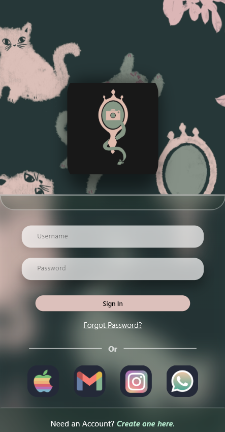

# Kamca

## Details:

This repository was created as a means to create the Kamca app, which was part of a Cakrawala University's asiggnment to me as a student, particularly in the program of Mobile Computing; lead by the lecturer Proffesor Aldrich Sancho Sapata Negara.

##### For better understanding this is also a link to the Figma design: 
https://www.figma.com/design/5yL2a3dWxneqcc83hESa7X/UAS_DgTg3_Group9?node-id=9-4&t=otDFtpvO1HDMW0I7-1

  
Log In.

  
  ### A screenshot of what that should look like:

  

